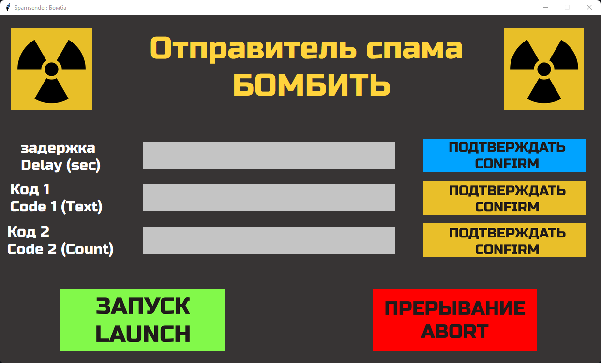
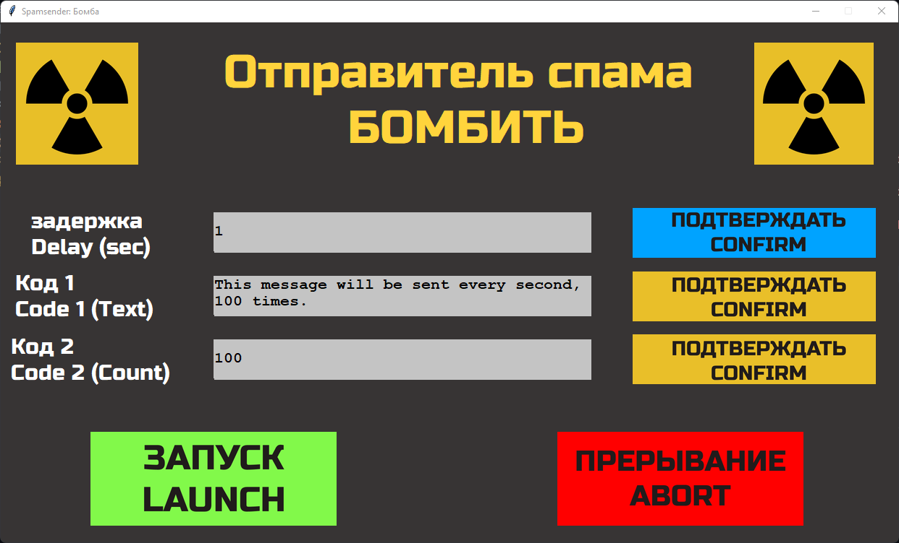

# SpamSender (GUI)
> A simple PyAutoGUI text spammer with a wacky TKinter GUI

## Installation and Setup
This application is written in Python 3.10, so it is recommended to have [Python>=3.10.2](https://www.python.org/downloads/release/python-3102/) installed on your device, though Python>=3.9.0 *should* work. You will also need [Git](https://git-scm.org/download) installed on your machine to clone this repo.

1. Clone this repository and cd into it
```sh
git clone https://github.com/Gargantuan5K/SpamSender-GUI.git
cd SpamSender-GUI
```

2. (RECOMMENDED): This app uses some python modules, which are already available inside the /venv/ folder. To activate this, run:

(WINDOWS)
```ps1
.\venv\Scripts\Activate.ps1
```
> No tested activate script for MacOS/Linux yet, but try `& source "./venv/activate"`


If you have activated the Virtual Environment in step 2 successfully, you may skip step 3.

3. (NOT RECOMMENDED, TRY STEP 2 FIRST): Run the following command:

(WINDOWS)
```ps1
pip.exe install -r .\requirements.txt
```

(LINUX/MACOS)
```sh
pip3 install -r ./requirements.txt
```

4. Run the source file:

(WINDOWS)
```ps1
python.exe ".\spamsender-gui.py"
```

(LINUX/MACOS)
```sh
python3 "./spamsender-gui.py"
```

> Note: There are currently no pre-compiled executable binaries available for this project, so you will have to run the python script directly. I may add binaries for the app later.


## How to use
After running the source file, you should see a window like this:



You can enter details about what text you want to spam in the window.
1. **Delay (sec)**: Enter the delay in seconds between each message written (Integer or with decimal point, must be positive)
2. **Code 1 (Text)**: Enter the message you wish to spam.
3. **Code 2 (Count)**: Enter the number of times you want the message to be sent.

**AFTER FILLING EACH FIELD, YOU MUST PRESS THE 'CONFIRM' BUTTON TO THE SIDE OF THE FIELD**


Once you're done filling all the fields, your window may look like this:




You can then click the green LAUNCH button. You will then have 10 seconds before the spamming begins.

At this time, *you must switch focus to whichever window you would like the message to be spammed on, and make sure to click on the text field in that window where the message will appear.* Note that on messaging platforms such as WhatsApp or Discord, the entered text will be sent as a message while being spammed.


**You can click the red ABORT button to stop the spamming at any time.** On aborting, the text, count and delay you specified before **will remain set**, and must be reset explicitly to change the message to be sent.


Also note that if you do not set 'Code 1 (Text)', the message spammed will default to 'Lorem'. If 'Delay (sec)' is left unset, it will default to a delay of 1 second. *If 'Code 2 (Count)' is not set, the message will not be spammed at all.*


## How does it work?

The window and GUI have been created using Tkinter, a simple Python GUI library. The actual spammer uses a common method of forcibly spamming text using PyAutoGUI's built-in 'write()' and 'press()' functions, which simulate actual key presses of each letter in the message, and 'Enter' to send it.


You may read the source code at spamsender-gui.py to look at the inner workings of this app.


Thanks for visiting, contact me if you find any bugs or would like to contribute to the project! You may feel free to create pull-requests if you find any issues or would like to make any improvements.


**This code is subject to the terms of the [MIT License](LICENSE).**
---